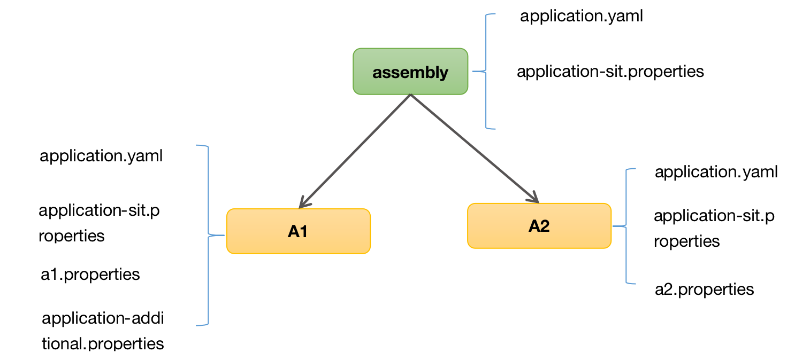

## 背景:
有些时候, 由于机器原因或者是环境原因, 我们希望将微服务架构离散的可运行组件打包到一起运行. 也就是说 ,一个进程运中行多个容器或者运行多个Application.

**<font color='red'>由于组件间的调用都是rpc调用. 那么怎样在不动组件代码的情况下, 且保证进程中的多容器中的组件功能完全隔离呢?</font>**

## apollo assembly:
我们看一下初始示例, 来源于携程配置中心 apollo assembly, 先看一下apollo的工程依赖:


### assembly(装配)
  只有一个类，就是一个main函数，同时启动了common、configservice、adminservice、portal组件。

### buildtools(构建工具)
  只有些脚本工具，和一些规范

### demo
  apollo的一些使用方法和示例


### assembly 源码(改造后):
```java
@SpringBootApplication(exclude = {DataSourceAutoConfiguration.class,
    HibernateJpaAutoConfiguration.class})
public class ApolloApplication {

  private static final Logger logger = LoggerFactory.getLogger(ApolloApplication.class);

  public static void main(String[] args) throws Exception {
    /**
     * Common
     */
    ConfigurableApplicationContext commonContext =
        new SpringApplicationBuilder(ApolloApplication.class).web(WebApplicationType.NONE).run(args);
    logger.info(commonContext.getId() + " isActive: " + commonContext.isActive());

    /**
     * ConfigService
     */
    if (commonContext.getEnvironment().containsProperty("configservice")) {
      ConfigurableApplicationContext configContext =
          new SpringApplicationBuilder(ConfigServiceApplication.class).parent(commonContext)
              .sources(RefreshScope.class).run(args);
      logger.info(configContext.getId() + " isActive: " + configContext.isActive());
    }

    /**
     * AdminService
     */
    if (commonContext.getEnvironment().containsProperty("adminservice")) {
      ConfigurableApplicationContext adminContext =
          new SpringApplicationBuilder(AdminServiceApplication.class).parent(commonContext)
              .sources(RefreshScope.class).run(args);
      logger.info(adminContext.getId() + " isActive: " + adminContext.isActive());
    }

    /**
     * Portal
     */
    ConfigurableEnvironment environment = commonContext.getEnvironment();
    String name = "Config resource 'class path resource [application-github.properties]' via location 'optional:classpath:/'";
    OriginTrackedMapPropertySource propertySource = (OriginTrackedMapPropertySource) environment.getPropertySources().get(name);
    Map<String, Object> source = propertySource.getSource();
    Map map = new HashMap();
    map.putAll(source);
    map.put("spring.datasource.url", "jdbc:mysql://127.0.0.1:3306/ApolloPortalDB?useUnicode=true&characterEncoding=UTF-8&autoReconnect=true");
    environment.getPropertySources().replace(name, new OriginTrackedMapPropertySource(name, map));
    // 一些配置bean在父上下文 commonContext 就加载了, 如 DataSourceProperties 的配置, 死活在 portalContext 中更新profiles配置无效, 要启动 PortalApplication, 只能改bean的属性值，若希望通过设置配置改变值必须 publishEvent 刷新bean
    commonContext.publishEvent(new EnvironmentChangeEvent(new HashSet<String>(){{add("spring.datasource.url");}}));
    logger.info(commonContext.getBean(DataSourceProperties.class).getUrl());

    // 一些配置bean在父上下文 commonContext 就加载了, 如 DataSourceProperties 的配置, 死活在 portalContext 中更新profiles配置无效, 要启动 PortalApplication, 只能改bean的属性值，
//    commonContext.getBean(DataSourceProperties.class).setUrl("jdbc:mysql://127.0.0.1:3306/ApolloPortalDB?useUnicode=true&characterEncoding=UTF-8&autoReconnect=true");
    if (commonContext.getEnvironment().containsProperty("portal")) {
      ConfigurableApplicationContext portalContext =
          new SpringApplicationBuilder(PortalApplication.class).parent(commonContext).profiles("portal")
                  //.profiles("portal")
              .sources(RefreshScope.class).run(args);
      logger.info(portalContext.getId() + " isActive: " + portalContext.isActive());
    }
  }
}  
```
<font color='red'>注意: 代码改造前,  portal 不能同时 和 configservice、adminservice运行. 原因是 portal 的数据源配置不能被正确加载.</font>

### 运行:


## springboot assembly:
基于 apollo assembly 示例,  验证配置的加载和优先级关系.

### A1源码:
[A1Application.java](a1-ms/src/main/java/com/test/a1/A1Application.java)

[TestController.java](a1-ms/src/main/java/com/test/a1/TestController.java)

### A2源码:
[A2Application.java](a2-ms/src/main/java/com/test/a2/A2Application.java)

[TestController.java](a2-ms/src/main/java/com/test/a2/TestController.java)

### Assembly源码:
[AssemblyApplication.java](assembly-ms/src/main/java/com/test/assembly/AssemblyApplication.java)

### 运行


### 配置和依赖图:



#### 总结:

- **<font color='red'>1、同名配置文件先加载上层配置, 即 application.yaml 和 application-sit.properties 只会加载assembly的</font>.** **尽管每个子context都会重新初始化 Environment, 依然只能加载到上层同名配置文件.**
- **<font color='red'>2、同名配置项,  profiles 定义的配置优先于默认的配置[即application.yaml] , 优先于 @PropertySource中配置 </font>**
- **<font color='red'>3、通过 SpringApplicationBuilder.properties() 设置的配置, 属于默认配置. 优先级低.</font>**
- **<font color='red'>4、通过 SpringApplicationBuilder.profiles("portal")加载到配置, 优先级最高. 见apollo assembly源码改造.</font>**
- **<font color='red'>5、此外 子context前, 还可以通过 System.setProperty() 设置配置.</font>**
- **<font color='red'>6、一些配置bean在父 Context 就加载了,  如 DataSourceProperties 配置,  若希望通过设置配置改变值必须 publishEvent 刷新bean, 否则只能通过getBean()去改bean的属性值.</font>** **换句话说, 子context 装配bean时, 先到父 context 上找, 没有再注册bean. 因此 A1 和 A2模块注意定义不同的包路径,  在装配bean时, 通过扫描不同包路径隔离.** 

**以上总结并非100%正确. 有兴趣的同学可以先阅读spring boot 启动源码, 并且自行测试.**